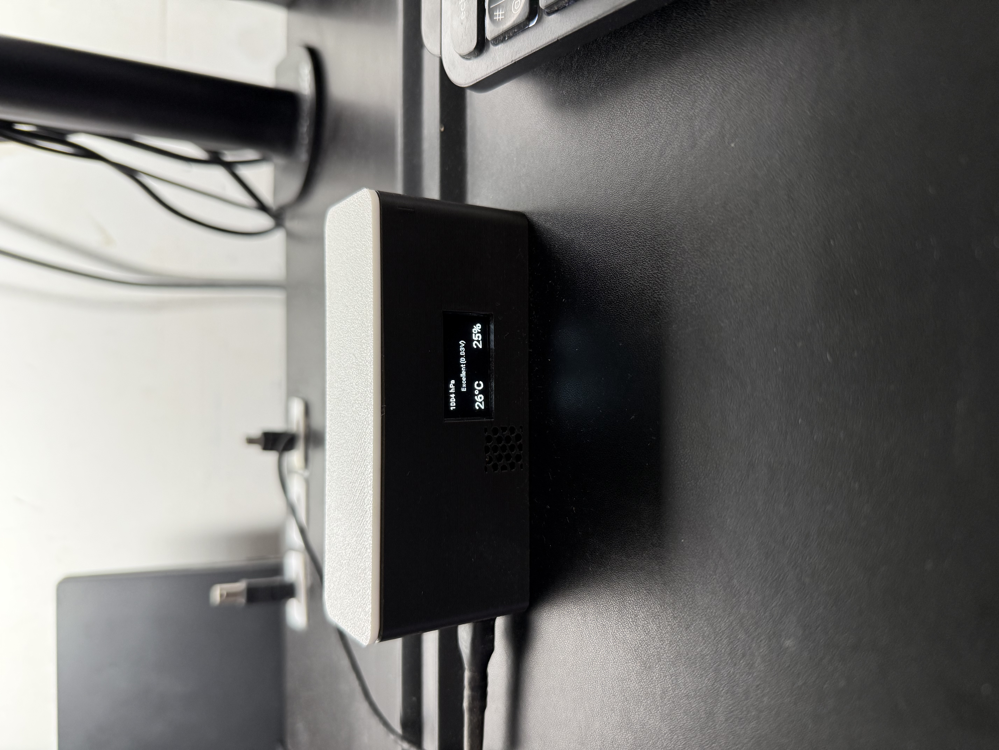
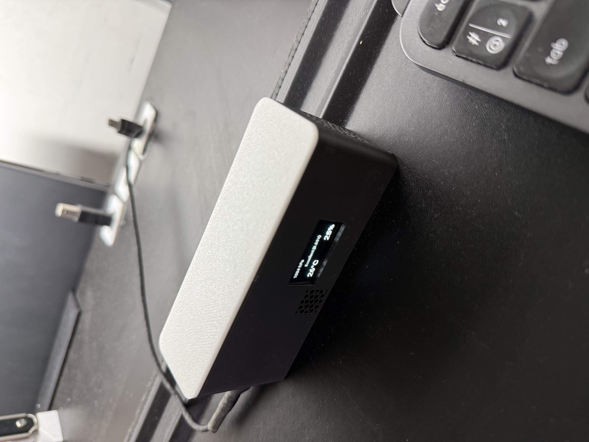
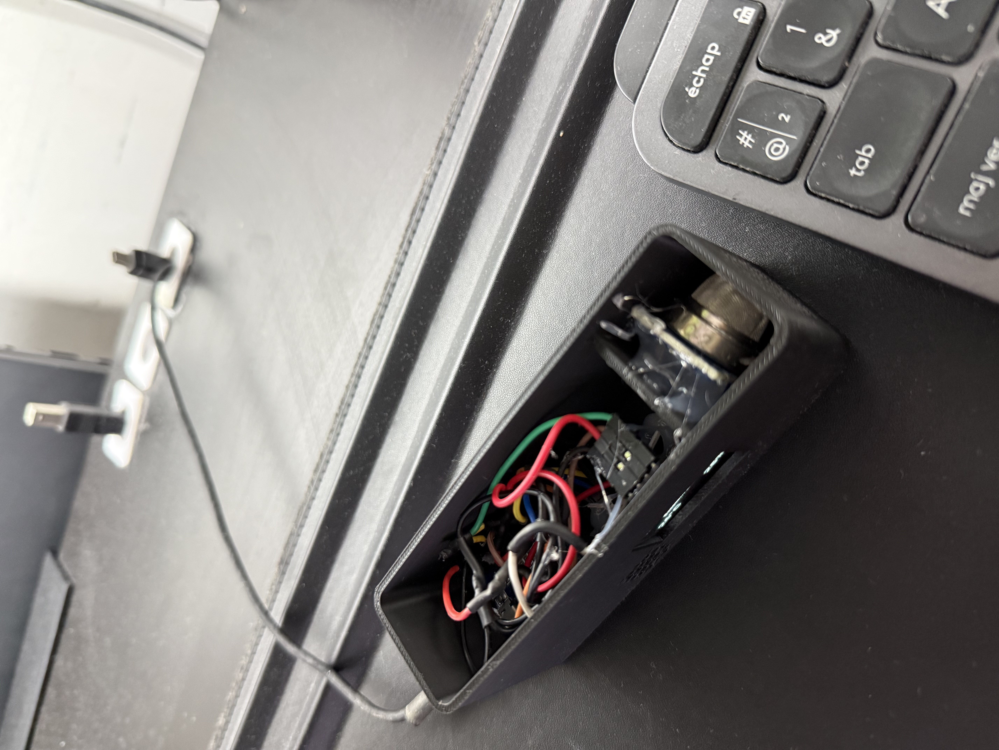

# air-quality-sensor

[](https://github.com/adamHassanBR/air-quality-sensor/releases)

[](https://creativecommons.org/licenses/by-nc/4.0/)


Capteur de qualité de l'air permettant de mesurer la **température**, l’**humidité**, la **pression** et la **qualité de l’air** (via un MQ-135).  
Le projet combine un **ESP8266 (ESPHome)**, un écran **OLED SSD1306** et un **boîtier imprimé en 3D**.

---

## 📸 Aperçu

| Vue avant                                  | Vue arrière                               | Vue angle                                  | Vue interne                           |
| ------------------------------------------ | ----------------------------------------- | ------------------------------------------ | ------------------------------------- |
|  |  |  |  |

---

## ✨ Fonctionnalités

- Mesure **BME280** (I2C) : température (°C), humidité (%), pression (hPa).
- Lecture **MQ-135** (ADC A0) → classification qualitative : _Excellent / Bonne / Moyenne / Mauvaise_.
- Affichage temps réel sur **OLED SSD1306 (128x64)**.
- Intégration complète avec **Home Assistant via ESPHome**.
- Accès OTA + API sécurisée + serveur web embarqué.

---

## 🧱 Matériel

### Bill of Materials (BOM)

| Ref    | Composant                                          | Qté | Remarques                       |
| ------ | -------------------------------------------------- | --- | ------------------------------- |
| MCU    | ESP8266 Wemos D1 mini (ou ESP-01 avec ADC externe) | 1   | Wi-Fi intégré                   |
| S1     | BME280 (I2C, adresse 0x76)                         | 1   | Température, humidité, pression |
| S2     | MQ-135 + module analogique                         | 1   | Sortie analogique vers A0       |
| D1     | OLED SSD1306 (I2C, adresse 0x3C)                   | 1   | Écran 128x64                    |
| BOX    | Boîtier imprimé 3D                                 | 1   | Fichiers STEP + 3MF fournis     |
| Câbles | Dupont / Micro-USB                                 | 1   | Connexions + alimentation       |

📂 Voir `hardware/bom.csv` pour la liste complète.

---

## 🔌 Câblage (Wemos D1 mini)

| Signal | Broche ESP8266 | Module            | Remarques                  |
| ------ | -------------- | ----------------- | -------------------------- |
| SDA    | D2 (GPIO4)     | BME280 + OLED     | Bus I2C partagé            |
| SCL    | D1 (GPIO5)     | BME280 + OLED     |                            |
| A0     | A0             | MQ-135 analogique | Tension 0–1 V              |
| VCC    | 3V3            | Tous              | Vérifier le courant MQ-135 |
| GND    | GND            | Tous              | Masse commune              |

> Adresses par défaut : **BME280 = 0x76**, **OLED = 0x3C**.

📂 Voir `hardware/wiring.md`.

---

## 🖨️ Impression 3D

Fichiers disponibles dans `enclosure/` :

- `Capteur_qualite_air_v29.step` → modèle CAO modifiable.
- `Capteur_qualite_air_v29.3mf` → profil d’impression (Bambu Studio).

**Paramètres recommandés (Bambu P1S / Prusa / Cura)** :

- Buse : 0.4 ou 0.6 mm
- Hauteur de couche : 0.2 mm
- Remplissage : 15–20 %
- Parois : 3
- Supports : désactivés (selon orientation)
- Matière : PLA

---

## 🔧 Installation firmware (ESPHome)

1. Installer **ESPHome** (addon Home Assistant ou via CLI `pip install esphome`).
2. Copier `firmware/esphome/air-quality-sensor.yaml`.
3. Créer `firmware/esphome/secrets.yaml` à partir du modèle fourni (`secrets.example.yaml`) et remplir :

```yaml
wifi_ssid: "TonWiFi"
wifi_password: "MotDePasse"
api_key: "CleAPI"
ota_password: "MotDePasseOTA"
```

---

## ⚙️ Utilisation

Le capteur publie :

- Température (°C)
- Humidité (%)
- Pression (hPa)
- MQ-135 Voltage (V)
- Qualité de l’air (texte)

L’écran OLED affiche :

- Pression en hPa
- Qualité + tension MQ-135
- Température en °C
- Humidité en %

## 🧪 Tests

- Vérifier I2C avec `i2c.scan: true` (dans les logs ESPHome).
- Souffler doucement près du MQ-135 : la tension A0 varie et le texte change sur l’écran.

## 🛠️ Roadmap

- Calibration avancée MQ-135 (ppm approximatif)
- Mode deep-sleep pour économiser la batterie
- Option d’activation/désactivation OLED via switch

## 📄 Licence

MIT – voir [LICENSE](LICENSE)

## 🙏 Crédits

BarbaroLab3D – design boîtier, intégration ESPHome
